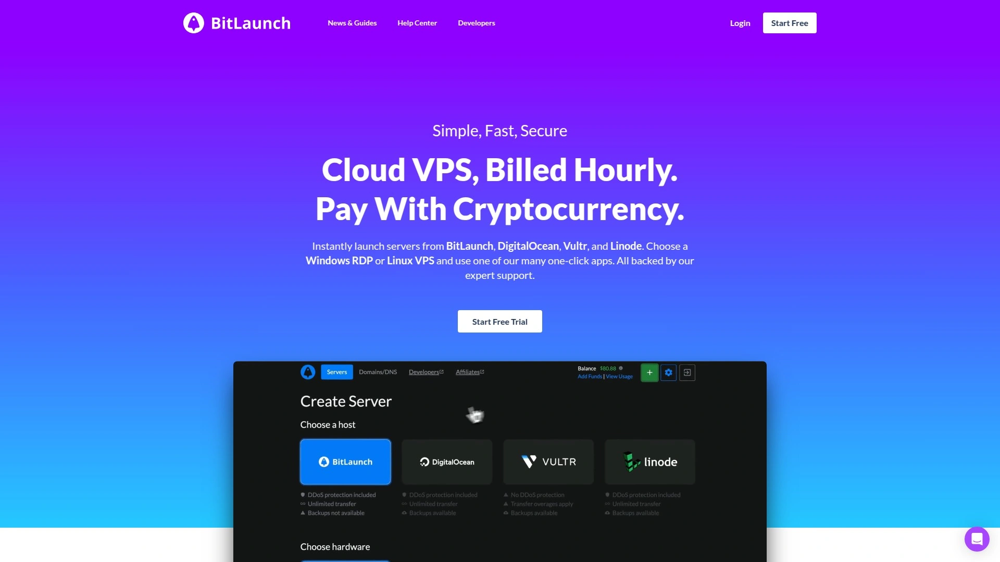
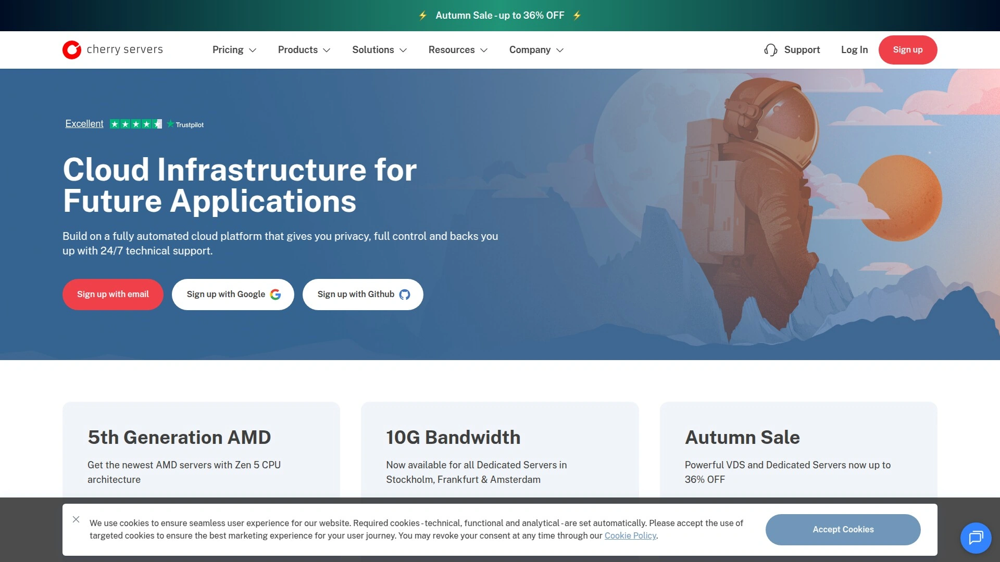
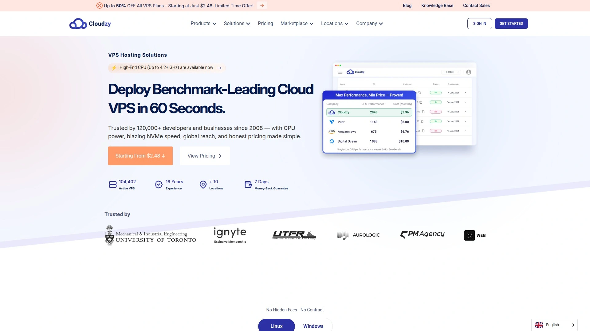
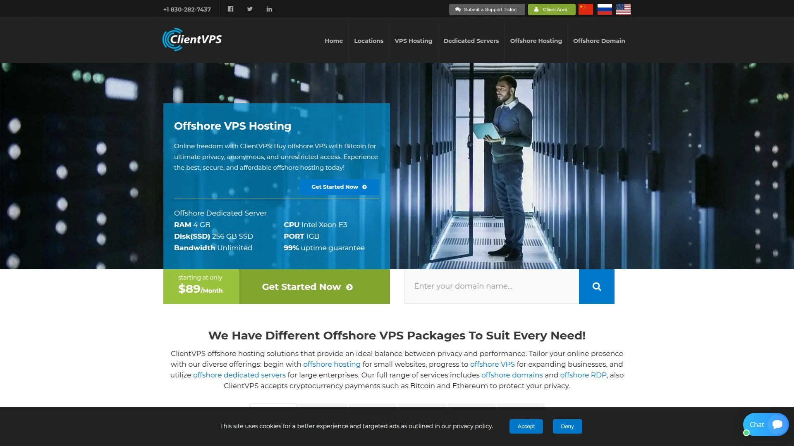
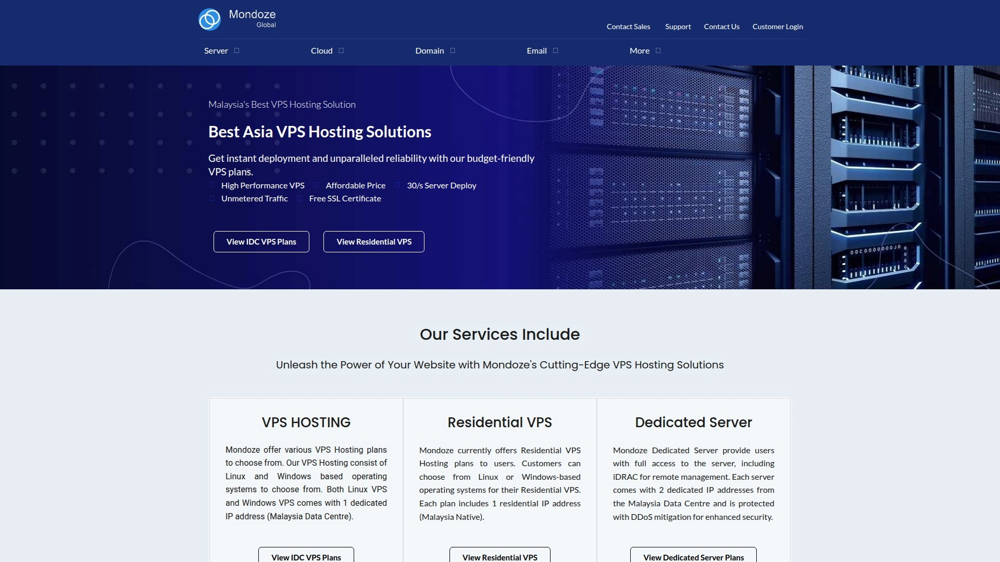
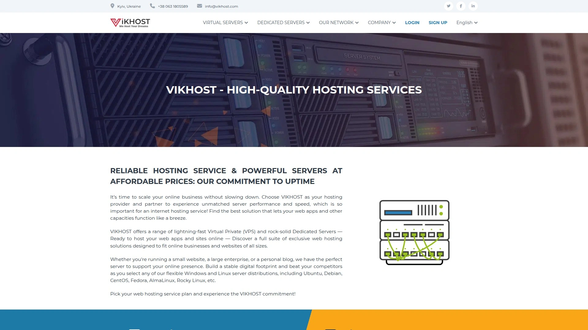

# 2025's Top 6 Best Cryptocurrency VPS Hosting Platforms

Paying for VPS hosting with credit cards means handing over identity documents, home addresses, and financial records to companies tracking every transaction while banks freeze accounts flagging server rental as suspicious activity—traditional payment methods destroy privacy before servers even deploy. Budget hosting providers accepting only fiat currency force you into lengthy KYC procedures, arbitrary spending limits, and payment processor bans when deploying VPNs or privacy tools they arbitrarily deem "suspicious".

The best cryptocurrency VPS platforms combine Bitcoin and altcoin payments requiring zero identity verification, instant server deployment within minutes of blockchain confirmation, and global datacenter networks spanning 20+ locations—delivering true anonymous hosting with enterprise-grade performance matching or exceeding traditional cloud providers.

***

## **[BitLaunch](https://bitlaunch.io)**

Unified platform deploying servers across DigitalOcean, Vultr, and Linode with cryptocurrency.

BitLaunch revolutionizes VPS hosting by aggregating multiple premium providers—DigitalOcean, Vultr, and Linode—into single platforms accepting Bitcoin and cryptocurrency payments without requiring personal information beyond email addresses. This unique aggregation model lets you deploy servers from industry-leading infrastructure providers while maintaining payment anonymity impossible when purchasing directly from those same companies demanding credit cards and identity verification. The 100,000+ customers since 2017 validate long-term sustainability and trustworthiness rare in anonymous hosting markets.

The 27 global datacenter locations span North America, Europe, Asia, and Australia through partnerships with top-tier providers, ensuring low-latency access regardless of target audience geography. This extensive coverage eliminates the single-location constraints plaguing smaller anonymous hosts, enabling global application deployment and redundancy strategies mixing providers and locations for improved resilience. The 99.9% average network uptime with 700+ daily server launches demonstrates reliability matching mainstream cloud platforms rather than unreliable anonymous hosts frequently disappearing overnight.

**Free DDoS protection included** on all BitLaunch servers protects against volumetric attacks crippling unprotected VPS instances. The stateful, high-capacity protection handles sophisticated attacks exceeding capabilities of budget shared hosting where DDoS traffic takes down entire server racks affecting hundreds of customers simultaneously. This enterprise-grade security comes standard rather than requiring expensive add-ons, substantially reducing total ownership costs while maintaining service availability during attacks.

Hourly billing with cryptocurrency payments eliminates commitments and recurring charges—deploy servers for specific tasks, pay only for actual usage hours, then destroy instances when finished. This granular billing model suits developers testing applications, researchers running temporary experiments, and privacy-conscious users avoiding subscription trails creating financial paper trails linking identities to server activities. The transparent pricing includes no hidden fees, setup charges, or surprise invoices common with traditional providers burying costs in fine print.

One-click application deployment through curated image library accelerates common use cases including OpenVPN, WireGuard, Outline, and Shadowsocks for privacy networking, LAMP/LEMP stacks for web hosting, WordPress for content management, and numerous other pre-configured environments. This automation eliminates manual server configuration consuming hours of expert time, making advanced setups accessible to users without systems administration backgrounds. The developer API and command-line tools enable programmatic server management integrating BitLaunch into automated deployment pipelines.

Windows RDP and Ubuntu Desktop options accommodate users needing graphical interfaces rather than command-line Linux environments. The Windows Server and Desktop editions support remote desktop workflows, while Ubuntu Desktop provides Linux GUI access for applications requiring graphical interaction. This versatility addresses diverse use cases from developers needing Linux terminals to businesses running Windows-only applications requiring remote access capabilities.

---

## **[Cherry Servers](https://www.cherryservers.com)**

Premium bare metal and VPS accepting 15+ cryptocurrencies with 99.97% uptime SLA.

Cherry Servers delivers high-performance bare metal dedicated servers and VPS infrastructure specifically designed for blockchain projects, cryptocurrency operations, and privacy-focused applications requiring maximum performance without virtualization overhead. The European-based provider emphasizes transparency, GDPR compliance, and technical excellence through latest-generation AMD EPYC and Intel processors paired with NVMe storage delivering consistent low-latency performance critical for latency-sensitive applications like trading bots and blockchain validators.

Cryptocurrency payment flexibility exceeds most competitors by accepting Bitcoin, Ethereum, Cardano, Binance Coin, Litecoin, XRP, TRON, Binance USD, Polygon, Solana, Bitcoin Cash, SHIBA INU, and more through secure CoinGate processing. This extensive crypto support accommodates users holding diverse digital assets without forcing conversions to Bitcoin before purchasing hosting. The straightforward payment integration completes transactions within minutes of blockchain confirmation, enabling immediate server deployment matching traditional credit card purchasing experiences.

**Fully customizable bare metal servers** eliminate the configuration limitations forcing users into preset tiers poorly matching actual requirements. Select exact CPU models, RAM quantities, storage capacities, and network bandwidth specifications building perfectly optimized servers for specific workloads without paying for unused resources inflating costs. This granular customization particularly benefits Web3 projects, proof-of-stake validators, and high-performance computing applications where resource balance dramatically affects performance and operating costs.

The 99.97% uptime SLA backed by compensation guarantees provides recourse when availability drops below contractual levels—unlike budget hosts promising uptime without SLA enforcement leaving customers without remedies during extended outages. This reliability commitment reflects enterprise-grade infrastructure management and redundant systems preventing single points of failure cascading into service disruptions. The European data center locations comply with strict EU regulations protecting customer data and maintaining high operational standards.

24/7 technical support from expert engineers rather than outsourced tier-1 agents reading scripts dramatically improves issue resolution speed and quality. The personal account managers provide direct communication channels bypassing ticket systems, enabling rapid responses during emergencies requiring immediate attention. This premium support justifies higher pricing compared to budget providers staffing support with undertrained personnel unable to resolve complex technical issues.

***

## **[Cloudzy](https://cloudzy.com)**

Privacy-focused VPS with Whonix VM, Monero payments, and 15+ global locations.

Cloudzy positions itself as privacy-first VPS provider catering specifically to cryptocurrency traders, activists, journalists, and privacy-conscious users requiring anonymous hosting without identity verification or invasive data collection. The Dubai-based company leverages UAE's business-friendly environment while maintaining global infrastructure spanning 15+ datacenter locations across North America, Europe, and Asia ensuring low-latency access regardless of user geography. The privacy commitment manifests through accepting Monero (XMR)—the premier privacy-focused cryptocurrency with untraceable transactions impossible to link back to buyers.

Specialized privacy configurations including pre-installed Whonix VMs provide turnkey anonymous computing environments combining Tor integration, secure isolation, and privacy-hardened operating systems. These ready-to-use privacy stacks eliminate complex manual configuration requiring expert knowledge, making advanced anonymity accessible to non-technical users unable to properly secure systems themselves. The Whonix setup routes all traffic through Tor network automatically, preventing IP leaks and traffic analysis revealing user activities or identities.

**Cryptocurrency trader optimization** acknowledges the substantial VPS demand from freelance crypto traders requiring uninterrupted exchange connectivity for automated trading bots and monitoring tools. The stable, high-performance servers ensure trading algorithms execute without interruption even during high volatility periods when milliseconds determine profit or loss. The global datacenter presence enables strategic server placement near exchange locations minimizing latency critical for high-frequency trading strategies and arbitrage opportunities.

The anonymous signup process requires minimal information avoiding intrusive KYC procedures typical of mainstream hosts. Combined with cryptocurrency payments leaving no financial paper trails, users maintain operational security impossible with traditional providers collecting extensive personal data shared with payment processors, tax authorities, and law enforcement upon request. This privacy protection particularly benefits users in restrictive jurisdictions where revealing hosting usage could trigger legal consequences or surveillance.

Cloudzy provides budget-friendly pricing making privacy-focused hosting accessible beyond wealthy individuals or well-funded organizations—the democratization of anonymous infrastructure enabling worldwide activists, whistleblowers, and journalists to operate securely without cost barriers excluding resource-constrained users from privacy tools. The money-back guarantee reduces risk when testing whether Cloudzy meets specific requirements before committing to longer-term deployments.

***

## **[ClientVPS](https://www.clientvps.com)**

Offshore anonymous hosting accepting Bitcoin, Litecoin, and Monero with no KYC.

ClientVPS specializes in offshore hosting jurisdictions providing legal protection against content takedown requests, copyright complaints, and surveillance demands that would succeed in US or EU locations with extensive legal cooperation frameworks. The offshore strategy protects controversial but legal content including file-sharing platforms, streaming services, and privacy tools that mainstream hosting providers prohibit despite no illegality. This positioning attracts users operating in grey areas facing arbitrary account terminations from conventional hosts enforcing vague acceptable use policies.

Zero KYC requirements represent ClientVPS's core differentiator—signup requires only email addresses with no identity verification, address confirmation, or phone numbers creating customer databases vulnerable to breaches or government requests. This minimal data collection protects both provider and customers by ensuring no sensitive information exists for attackers to steal or authorities to subpoena. The privacy-first approach extends through cryptocurrency-only payments preventing financial institution surveillance tracking hosting purchases.

**Cryptocurrency payment diversity** including Bitcoin, Litecoin, and Monero accommodates different privacy preferences and technical capabilities. While Bitcoin provides widespread acceptance, the transparent blockchain enables transaction tracing linking payments to individuals. Monero's privacy-focused design obscures transaction details including sender, recipient, and amounts—making it impossible for blockchain analysis companies tracking Bitcoin transactions to identify ClientVPS customers or connect hosting activities to real-world identities.

Hardware firewall protection included with all VPS instances provides network-level defense against DDoS attacks and intrusion attempts without requiring customer configuration or expertise. The 15 terabytes per second filtering capacity handles massive volumetric attacks exceeding capabilities of budget shared hosting where attacks overwhelm network infrastructure affecting hundreds of customers simultaneously. This enterprise-grade security comes standard rather than expensive optional add-ons inflating total costs.

KVM virtualization provides dedicated resources guaranteed to each VPS instance rather than oversold shared resources where "unlimited" plans collapse under actual usage. The dedicated CPU, RAM, and storage ensure consistent performance regardless of other customers' activities on shared hardware—eliminating "noisy neighbor" effects where resource-intensive applications from other users degrade your server's performance. Unlimited bandwidth removes data transfer caps enabling high-traffic applications, media streaming, and backup operations without overage charges.

***

## **[Mondoze](https://www.mondoze.com)**

Affordable Malaysia-based anonymous Bitcoin VPS with dedicated IP addresses.

Mondoze operates from Malaysia providing strategic geographic positioning for users targeting Asian markets or requiring infrastructure outside Five Eyes surveillance alliance jurisdictions. The Southeast Asian location offers regulatory advantages over Western providers subject to extensive intelligence sharing agreements and mandatory data retention laws requiring customer activity logging. This jurisdiction selection particularly benefits privacy-conscious users wanting hosting infrastructure in regions with less invasive surveillance frameworks and limited cooperation with Western law enforcement.

Dedicated IP addresses included with every VPS plan ensure you're the sole user of assigned addresses rather than sharing IPs with hundreds of unknown customers potentially abusing addresses through spam or attacks. Shared IP reputations suffer when other users trigger blacklisting, affecting your legitimate applications despite no wrongdoing on your part. The dedicated addressing prevents these reputation problems while enabling proper SSL certificate configuration, email server operation, and application requiring clean IP history.

**Multiple cryptocurrency acceptance** including Bitcoin and Ether accommodates users holding different digital assets without forcing conversions adding transaction fees and delays. The straightforward payment processing completes within blockchain confirmation timeframes, enabling rapid server deployment matching traditional payment speed. For customers requiring additional cryptocurrency options beyond Bitcoin and Ethereum, the support team accommodates special requests adding payment flexibility impossible with rigid payment processors accepting only specific assets.

Budget-friendly pricing positions Mondoze competitively against premium anonymous hosts while maintaining adequate performance for typical use cases including VPN servers, web hosting, development environments, and privacy applications. The affordable rates particularly benefit users in developing nations where Western hosting pricing proves prohibitively expensive relative to local wages. This accessibility expands anonymous hosting beyond wealthy Western users into global markets requiring privacy infrastructure at sustainable price points.

The Linux-focused infrastructure optimizes for open-source applications and development workflows common in privacy and security communities. While Windows support remains limited, the Linux specialization delivers superior value for users operating typical server applications requiring stability, security, and resource efficiency where Linux excels over Windows Server editions. The technical focus attracts developers and systems administrators comfortable with command-line environments rather than GUI-dependent Windows administrators.

---

## **[VIKHOST](https://www.vikhost.com)**

Ukrainian provider accepting 12+ cryptocurrencies with no KYC and 99.9% uptime guarantee.

VIKHOST operates from Ukraine offering strategic European datacenter access alongside North American locations through global infrastructure partnerships. The Ukrainian base provides regulatory environment respecting user privacy while maintaining European technical standards and connectivity—balancing privacy benefits of offshore jurisdictions with quality infrastructure typical of European providers. The multiple datacenter locations spanning US, Canada, and Europe enable geographic redundancy and audience-targeted deployments optimizing latency for specific user populations.

Exceptional cryptocurrency variety accepting Bitcoin, Litecoin, Monero, Ethereum, Tron, Dogecoin, Tether across multiple chains, Dash, BNB, Shiba Inu, Ethereum Classic, Bitcoin Cash, and Zcash accommodates virtually any digital asset users might hold. This extensive payment flexibility eliminates the conversion friction and fees associated with exchanging altcoins into Bitcoin before purchasing hosting. The broad acceptance signals genuine crypto-friendly philosophy rather than opportunistic Bitcoin-only support common among providers following trends without understanding cryptocurrency community preferences.

**No KYC requirements enhance anonymity** by eliminating identity verification creating customer databases linking real-world identities to server deployments. The minimal signup process requires only contact information for service delivery without invasive documentation proving identity, residence, or payment source. This privacy protection particularly benefits users in restrictive jurisdictions where revealing hosting usage could trigger surveillance, legal consequences, or physical danger from authoritarian regimes monitoring internet activities.

High-performance hardware from Dell, SuperMicro, and HP paired with 1 Gbps or 10 Gbps network connectivity delivers enterprise-grade infrastructure rivaling premium mainstream providers. The quality components ensure reliable operation, fast disk I/O, and consistent network performance supporting demanding applications requiring stability and speed. The 99.9% uptime guarantee backed by 24/7 technical support provides confidence in operational reliability essential for production deployments where downtime directly costs revenue or damages reputation.

The refund policy excluding cryptocurrency payments reflects blockchain transaction irreversibility rather than customer hostility—once crypto transfers confirm, no mechanism exists for chargebacks or reversals inherent to credit card payments. This limitation represents cryptocurrency technical reality rather than VIKHOST-specific policy, emphasizing the importance of properly evaluating services before purchasing with irreversible payment methods. Trial periods and money-back guarantees fundamentally incompatible with cryptocurrency payments requiring users to commit based on provider reputation and user reviews.

---

## FAQ

**Can law enforcement actually trace cryptocurrency payments back to you when buying anonymous VPS?**

Bitcoin transactions remain permanently recorded on public blockchain enabling analysis companies and law enforcement tracing payments between addresses, eventually connecting them to exchanges requiring identity verification. Use privacy-focused cryptocurrencies like Monero (XMR) or Zcash (ZEC) with built-in transaction obfuscation preventing blockchain analysis. Never purchase crypto with personally-identifying payment methods if anonymity matters—use Bitcoin ATMs, peer-to-peer cash trades, or mining to acquire untraceable coins. Even with privacy coins, operational security mistakes like reusing addresses, connecting through personal IP addresses, or linking accounts through shared information can compromise anonymity despite technically anonymous payments.

**What's the real difference between "offshore" and "anonymous" VPS hosting?**

Offshore hosting refers to servers in jurisdictions with favorable legal frameworks resisting content takedown requests, copyright claims, or surveillance demands—the geographic location provides legal protection rather than technical anonymity. Anonymous hosting focuses on privacy through minimal data collection, cryptocurrency payments, and no identity verification—protecting who you are rather than where servers physically exist. Choose offshore for legal protection hosting controversial content; choose anonymous when hiding identity matters more than jurisdiction. Ideal privacy hosting combines both—offshore jurisdictions with anonymous signup and cryptocurrency payments providing comprehensive protection.

**Do cryptocurrency VPS providers actually delete your data or keep records after service cancellation?**

Reputable privacy-focused hosts like BitLaunch and ClientVPS claim to minimize data retention, but verify through privacy policies and user reviews rather than trusting marketing promises. No technical mechanism prevents providers from secretly logging activities regardless of stated policies—ultimate privacy requires trusting hosting companies or deploying additional anonymity layers like VPNs, Tor, or encrypted disks protecting data even if hosting providers cooperate with adversaries. Always assume hosting providers could retain data and design security models accordingly through encryption, traffic obfuscation, and compartmentalization minimizing exposure if provider cooperation or compromise occurs.

***

## Conclusion

Cryptocurrency VPS hosting liberates users from invasive identity verification, financial surveillance, and geographic restrictions plaguing traditional cloud providers demanding extensive personal information before deploying simple servers. These six platforms combine genuine privacy through minimal data collection and crypto payments with enterprise-grade infrastructure, global datacenter networks, and reliable support—proving anonymous hosting no longer requires sacrificing performance or reliability. [BitLaunch](https://bitlaunch.io) particularly excels for users wanting premium infrastructure from DigitalOcean, Vultr, and Linode without identity verification—combining 27 global datacenters, 99.9% uptime, free DDoS protection, and instant cryptocurrency deployment through unified platform trusted by 100,000+ customers since 2017 for truly anonymous cloud hosting.
